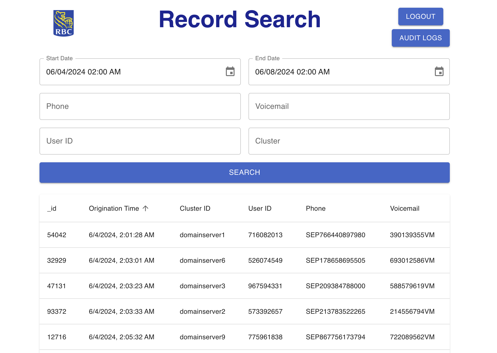

# RBC ISE A&I Records Management System Assignment



## Project Overview

The Records Management System is a comprehensive web application designed to efficiently manage and search telephony records. It provides endpoints to fetch records from JSON files, MongoDB, and SQL Server, along with a user-friendly frontend for easy interaction. The backend is built using FastAPI, and the frontend is developed using React.

## Technologies Used

- **Backend:**
  - FastAPI
  - SQLAlchemy
  - SQLite
  - PyJWT
  - MongoDB
  - SQL Server
- **Frontend:**
  - React
  - Material-UI
- **Others:**
  - Uvicorn (for ASGI server)

## Setup and Installation

### Prerequisites

- Python 3.8+
- Node.js 14+
- MongoDB (for MongoDB endpoint)
- SQL Server (for SQL Server endpoint)

### Backend Setup

1. **Clone the repository:**

   ```sh
   git clone https://github.com/dylanpulver/rbc_takehome.git
   cd rbc_takehome
   ```

2. **Install Python dependencies:**

    ```sh
    pip3 install -r backend/requirements.txt
    ```

3. **Activate the virtual environment:**

    ```sh
    source backend/venv/bin/activate
    ```

4. **Run the backend server:**

    ```sh
    uvicorn backend.main:app --reload
    ```

### Frontend Setup

1. **Navigate to the frontend directory:**

    ```sh
    cd records-app
    ```

2. **Install Node.js dependencies:**

    ```sh
    npm install
    ```

3. **Run the frontend server:**

    ```sh
    npm start
    ```

## Getting Started

**Access the frontend:**

1. Open your browser and navigate to: http://localhost:3000. Upon starting the frontend with `npm start` it will automatically open in the browser.
2. This application is protected with a login page. For demo purposes the sign in credentials are hard-coded to:

    ```sh
    username: user@example.com
    password: password
    ```

## API Documentation

The backend API documentation is automatically generated by FastAPI and can be accessed via the following URLs:

- **Swagger UI**: [http://localhost:8000/docs](http://localhost:8000/docs)
- **ReDoc**: [http://localhost:8000/redoc](http://localhost:8000/redoc)

You can interact with the API directly through these interactive documentation pages.

## Features and Considerations

- **Search Functionality**: Allows filtering on any field or combination of fields in the main search. Users can filter by start date, end date, phone, voicemail, user ID, and cluster ID.
- **Audit Log**: An audit log feature is added to keep track of user actions. Each action is logged with details like path, method, status code, timestamp, client IP, and user agent.
- **CSV Download**: Both the main records and audit logs can be downloaded as CSV files.
- **Loader and Button States**: A loader is shown, and the search button is disabled during search operations to avoid multiple requests.
- **Logout**: Demonstrates logging out, which clears the search session.
- **Pagination and Sorting**: Both tables have customizable pagination. All columns on both tables are sortable.
- **Date Pickers**: User-friendly date pickers are provided for selecting start and end dates.
- **Rate Limiting**: For illustrative purposes, we have implemented basic rate limiting using the slowapi library. This helps prevent abuse of the API by limiting the number of requests a user can make in a certain time period. The rate limit is currently set to allow 5 requests per minute for the login endpoint.

## MongoDB Endpoint

The following steps are illustrative, and included to show what the steps for using the mongoDB endpoint would look like.

1. Set up a MongoDB server.
2. Insert your data into the specified MongoDB database and collection.
3. Update the MongoDB connection string and database/collection names in the `mongodb_endpoints.py` file.
4. Uncomment the line `# app.include_router(mongodb_router)` in `main.py`.
5. Use the `/mongodb-records` endpoint to query records from MongoDB.

## SQL Server Endpoint

The following steps are illustrative, and included to show what the steps for using the SQL Server endpoint would look like.

1. Set up a SQL Server instance.
2. Insert your data into the specified SQL Server database.
3. Update the SQL Server connection string in the `sqlserver_endpoints.py` file.
4. Uncomment the line `# app.include_router(sqlserver_router)` in `main.py`.
5. Use the `/sqlserver-records` endpoint to query records from SQL Server.

## Further Improvements and Production Scaling

- **Dockerize the application**: Ensure consistent environments and simplify deployment.
- **Implement CI/CD pipelines**: Use GitHub Actions to automate testing and deployment.
- **Scale the backend**: Use a more robust database system and implementing caching mechanisms.
- **Improve security**: Integrate OAuth2 for authentication and enabling HTTPS.
- **Automated Data Collection and Injection Jobs**: Implement automated data collection and injection jobs written in Python as part of a Big Data Pipeline with Elasticsearch.
- **Deployment**: Implement CI-driven deployment built on top of OCP 4 and PCF.
- **Refactor to OOP**: Consider refactoring to a class architecture using Object-Oriented Programming (OOP) to better manage complexity as the application grows.
- **Automated Testing**: Add unit tests and integration tests for both backend and frontend to ensure code quality.
- **Comprehensive Authentication and Authorization**: Implement role-based access control (RBAC) to enhance security.
- **Alerts and Monitoring**: Set up alerts for critical issues or performance degradation using monitoring tools.
- **Form Validation and Error Handling**: Add form validation and error handling on the frontend for better user experience.
- **Enhanced UI**: Enhance the user interface with tooltips and animations to improve usability.
- **Localization and Internationalization**: Add support for multiple languages to the frontend to cater to a broader audience.
- **Load Balancers**: Implement load balancers to distribute traffic evenly and improve the scalability and reliability of the application.

## Conclusion

This project demonstrates the integration of various technologies to build a full-stack web application for managing records. The setup guides provided above will help you get the application up and running quickly.

## Closing Thoughts

I am thrilled at the opportunity to contribute to RBC and am eager to bring my background in secure software development to your team. This project not only reinforced my interest in the challenges at RBC but also excited me about the potential impacts we could achieve together. Thank you for considering my application and for the opportunity to participate in this exercise.

I look forward to the possibility of discussing my application further and hopefully contributing to RBC’s success.
